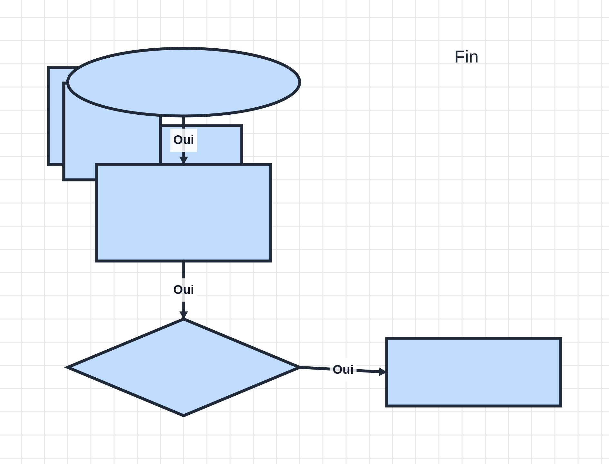

# Sputnk Draw 🎨

Un outil de dessin vectoriel simple pour faire des **logigrammes** sur le web — directement dans le navigateur, rien n'est stocké sur le serveur.

🔗 **Live :** https://draw.sputnk.net



## Caractéristiques

- ✏️ **Crayon** libre avec pointe de taille ajustable
- 📏 **Lignes** droites
- 🔷 **Formes** prêtes : rectangle, rond/ellipse, triangle, losange (et parallélogramme)
- ➡️ **Flèches intelligentes** avec texte, qui s'**accrochent automatiquement** aux formes (aimant sur les 4 demi-côtés : haut, bas, gauche, droite) et suivent la forme quand on la déplace
- 🔤 **Texte** libre
- 🪣 **Pot de peinture** — remplit n'importe quelle forme
- 🖱️ **Sélection** pour déplacer, redimensionner, copier/coller et supprimer des éléments
- 🎨 **Palette prédéfinie** + **color picker** complet arbitraire
- ↔️ **Grille** de fond activable
- 💾 **100 % local** : le dessin vit dans la mémoire du navigateur (localStorage), auto-sauvegardé
- 📤 **Export PNG** (haute résolution)
- 📦 **Format propriétaire** `.spdraw` (JSON) qui conserve chaque élément pour réouvrir/modifier plus tard

## Démarrage rapide

### Inspecter / développer

```bash
# sert le dossier en local
python3 -m http.server 8080
# puis ouvre http://localhost:8080
```

### En Docker

```bash
docker build -t sputnk-draw .
docker run -d --name sputnk-draw --restart unless-stopped -p 8065:80 sputnk-draw
# → http://localhost:8065
```

Le conteneur est une simple image `nginx:alpine` qui sert les fichiers statiques.

## Utilisation

Sélectionnez un outil dans la barre de gauche, puis cliquez/glissez sur le canevas :

| Outil | Raccourci | Comportement |
|-------|-----------|--------------|
| Sélection | `V` | clic pour choisir, glisser pour déplacer, poignées pour redimensionner, `Suppr` pour effacer |
| Crayon | `P` | glisser pour tracer à main levée |
| Trait | `L` | glisser pour tracer un trait droit |
| Rectangle / Rond / Triangle / Losange / Parallélogramme | `R` `O` `T` `D` `Y` | glisser pour dessiner (Maj = garder les proportions) |
| Flèche | `A` | glisser depuis une forme vers une autre : l'extrémité s'aimanate. Rentrer le texte de la flèche au relâchement |
| Texte | `T` | cliquer pour placer, taper le texte |
| Pot de peinture | `F` | cliquer une forme pour la remplir avec la couleur de remplissage |

- **Couleur** : choisissez dans la palette, ou ouvrez le sélecteur complet pour une couleur arbitraire.
- **Épaisseur** : le curseur règle l'épaisseur du trait (crayon, lignes, contours, flèches).
- **Grille** : bouton grille pour afficher/masquer la grille de fond.
- **Flèche aimantée** : quand la flèche est sélectionnée, les extrémités s'accrochent au milieu d'un côté des formes. Déplacez la forme reliée → la flèche suit.
- **Export PNG** : rend l'image en haute résolution (×3).
- **Sauvegarder / Ouvrir** : format `.spdraw` (tous les éléments, ré-édition complète).
- **Copier/Coller** : `Ctrl/Cmd+C` / `Ctrl/Cmd+V` (duplique les éléments sélectionnés).

Raccourcis : `V` sélection, `P` crayon, `L` trait, `A` flèche, `T` texte, `F` pot, `Esc` désélection, `Ctrl+Z` annuler, `Ctrl+Shift+Z` refaire. **Molette = zoom** (centré sous le curseur), **clic droit (ou espace + glisser) = déplacer la vue**, `Ctrl+C`/`Ctrl+V` = copier/coller. Le canvas est **infini** : dézoomez tant que vous voulez, la grille reste régulière.

## Formats

- **`.spdraw`** — format propriétaire JSON. Il contient tous les éléments (position, taille, couleurs, épaisseur, texte, connexions). Il se ré-ouvre dans Sputnk Draw pour une reprise/modification complète.
- **PNG** — export pixel simple, idéal pour partager/afficher.

## Structure

```
├── index.html      # page + barre d'outils
├── css/styles.css  # style
├── js/
│   ├── model.js    # modèles d'éléments + sérialisation
│   ├── renderer.js # rendu canvas
│   ├── tools.js    # logique des outils + aimant des flèches
│   └── app.js      # contrôleur principal, UI, export/import
├── Dockerfile
├── nginx.conf
└── README.md
```

## Technologies

Vanilla JavaScript + HTML5 Canvas + ES modules. Aucune dépendance, aucun build : `nginx:alpine` sert des fichiers statiques. Rapide, léger, fonctionne hors-ligne.

## Licence

MIT — voir [LICENSE](LICENSE).

---

*Sputnk Draw — fait maison pour le réseau Sputnk.*